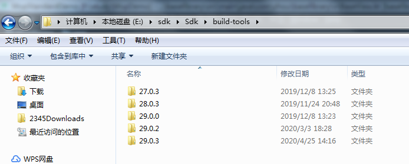
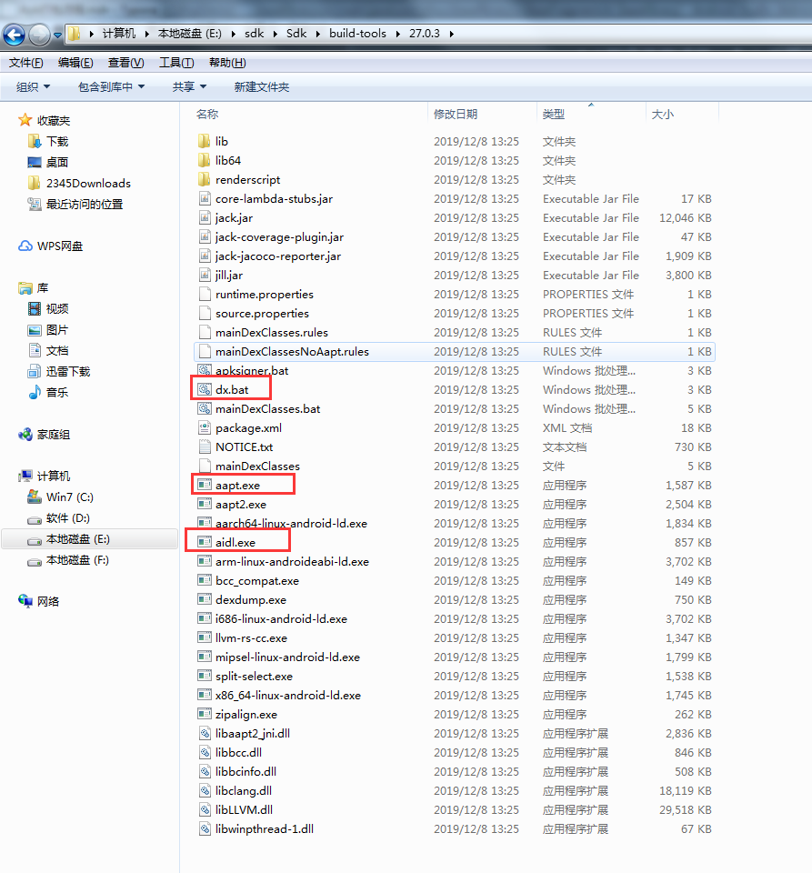
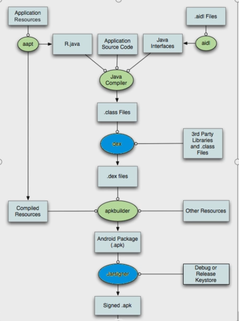

# Apk打包流程

为什么面试要问apk打包？

因为：热修复，插件化这种高级技术都需要理解apk打包原理。apk打包与平时一键打包，gradle命令打包完全不同。

Apk的文件格式是一个zip压缩包。

解压缩一个apk之后，有

- assets 目录，
- lib目录，
- META-INFO签名目录，
- R文件。
- 清单manifest文件。
- 多个Dex文件。
- resources.arsc资源映射文件。

apk打包，as帮我们做了全自动处理，但是实际上有很多打包工具，这些工具都在sdk的build-tools目录中,只不过一般情况下不需要我们手动去用。

比如 

- dex.bat 工具，是把java的jar包打成dex文件。
- aapt.ext / aapt2.ext 是资源文件打包工具，res目录下所有文件，都会被这个aapt工具生成一个int值，放在R.java中
- aidl.ext 工具，aidl （**android-interface-definition-language** 安卓接口定义语言）是安卓处理 IPC（Inter-process communitation 进程间通信）的一种方式，可以让当前app和其他app进行通信。

- apksigner.bat apk签名工具，对apk进行签名。
- zipalign.ext 字节码对齐工具，用于对齐apk的字节码，加快apk文件在设备上的读取速度。

完整的apk打包流程如下图：

说人话来解读apk打包的全流程：

作为源文件，我们会拥有 资源类，和代码类。

资源类都处在res目录下，这个目录下的所有文件都会打包成二进制。但是资源类有特例，那就是raw和assets，这两个目录下也可以放置资源文件，图片啊音视频文件什么的。但是两者有区别，前者是res的子目录，所以它会受到R.java文件的管束，使用raw下的文件也可以用R.raw.xxxxx , 而assets是在src/main目录下，使用它只能用AssetsManager读文件流的方式。但是他们共同点都是，不会被编译成二进制。

资源文件最终会生成一个**资源映射表**文件。resources.arsc 

代码类，包括**我们自己写的java/kotlin 代码**,**AIDL生成的java类**，以及aapt生成的**R.java文件**，这些都会被jdk的javac打包成class，然后别忘了第三方的class文件，这些class文件都会被集中打包成多个dex（因为一个dex有65535方法数的限制，因而出现了多dex的打包方式）。

因此apk包内部的classes.dex来自于java源文件。 资源映射表 **resources.arsc**,res文件目录。以及清单文件，都会在这个时候，被打包进apk。apk文件的本质是zip压缩包。

有了这个apk压缩包之后，还有最后一步，apk签名。（V1,V2/V3）. 使用提前定制好的keystore文件对apk进行签名。签名之后，apk包内部会多出一个META-INFO签名包（这是V1签名特有的，之后v2，v3弃用了，V2V3采用的是zip加密技术, 和zip文件格式有关）