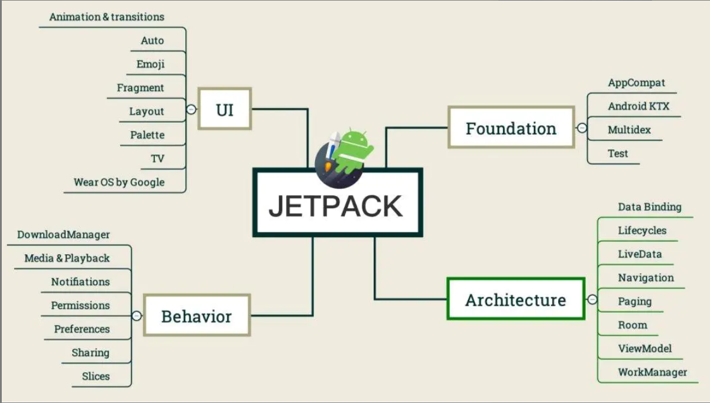
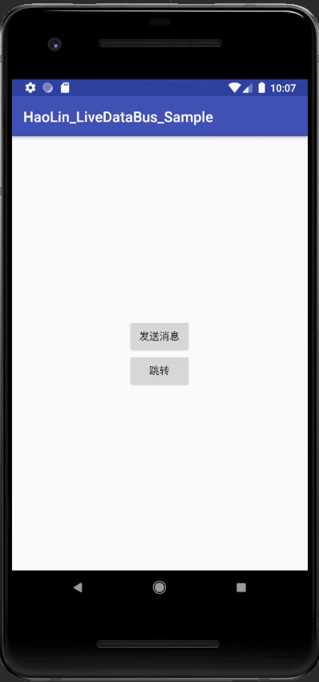

# Fragment之间是如何通信的


- 常规方法：利用接口，广播，第三方SDK（ EventBus，RxJava ）或者handler 传输 等等，都可以。


但是，既然问到这个问题，并不是问你这种原始方法，而是 LiveDataBus . 

LiveDataBus是谷歌官方在18年谷歌IO大会上提出的方案。目的是解决Fragment之间，Activity之间，Fragment和Activity之间的通信问题。当然 它也是属于jetpark的一部分，jetpark是谷歌为了开发者更好的开发体验而整合出的一系列组件。

下图是jetpark:



# LiveDataBus使用方法

使用jetpark比起杂乱的第三方架构，好处就是 不用考虑 导包的问题。

**我以2个Activity的数据传递为案例**，从MainActivity跳转到SecondActivity，并且携带数据。然后从SecondActivity退回MainActivity，也要携带数据。

案例只有3个类：

第一个类，我们在使用RxBus或者EventBus时也会有这么一个事件总线单例类：

```kotlin
package com.zhou.hank

import androidx.lifecycle.MutableLiveData
import java.util.*

class LiveDataBus private constructor() {
    private val bus //防止重复注册，使用Map
            : MutableMap<String, MutableLiveData<Any>?>

    private object SingletonHolder {
        val LIVE_DATA_BUS =
            LiveDataBus() // 这个也是一种单例的写法,静态内部类
    }

    /**
     * 创建一个 观察者，也就是注册事件
     *
     * @param key
     * @param type
     * @param <T>
     * @return
    </T> */
    @Synchronized
    fun <T> with(key: String, type: Class<T>?): MutableLiveData<T>? {
        if (!bus.containsKey(key)) { // 不包含，则添加
            bus[key] = MutableLiveData()
        }
        return bus[key] as MutableLiveData<T>? // 包含，则直接返回
    }

    companion object {
        /**
         * 单例的getInstance方法
         *
         * @return
         */
        fun get(): LiveDataBus {
            return SingletonHolder.LIVE_DATA_BUS
        }
    }

    init {
        bus = HashMap()
    }
}
```

第一个Activity：

```kotlin
package com.zhou.hank

import android.content.Intent
import android.os.Bundle
import android.util.Log
import android.view.View
import androidx.appcompat.app.AppCompatActivity
import androidx.lifecycle.Observer
import com.haolin.livedatabus.zhou.R

class MainActivity : AppCompatActivity() {
    override fun onCreate(savedInstanceState: Bundle?) {
        super.onCreate(savedInstanceState)
        setContentView(R.layout.activity_main)
        /**
         * 注册事件
         *
         * 参数 MainActivity是 事件key，Huawei.class是一个自定义类，表明：我只响应key为MainActivity，并且类型为 Huawei.class的事件
         * onChange方法重写，
         *
         */
        LiveDataBus.get()
            .with("MessageActvity1", String::class.java)
            ?.observe(this, Observer { str ->
                if (str != null) {
                    Log.d("messageTag", "MainActivity:收到消息$str")
                }
            })
    }

    fun sendMessageOnClick(view: View?) {
        LiveDataBus.get()
            .with("MessageActvity2", String::class.java)
            ?.postValue("MainActivity 发到TwoActivity")
    }

    fun jumpActivityOnClick(view: View?) {
        startActivity(Intent().setClass(this@MainActivity, SecondActivity::class.java))
    }
}
```

第二个Activity：

```kotlin
package com.zhou.hank

import android.os.Bundle
import android.util.Log
import android.view.View
import androidx.appcompat.app.AppCompatActivity
import androidx.lifecycle.Observer
import com.haolin.livedatabus.zhou.R


/**
 * 作者：haoLin_Lee on 2019/04/25 22:40
 * 邮箱：Lhaolin0304@sina.com
 * class:
 */
class SecondActivity : AppCompatActivity() {
    override fun onCreate(savedInstanceState: Bundle?) {
        super.onCreate(savedInstanceState)
        setContentView(R.layout.activity_two)
        LiveDataBus.get()
            .with("MessageActvity2", String::class.java)
            ?.observe(this, Observer { str ->
                if (str != null) {
                    Log.d("messageTag", "TwoActivity:收到消息$str")
                }
            })
    }

    fun sendMessageOnClick(view: View?) {
        LiveDataBus.get()
            .with("MessageActvity1", String::class.java)
            ?.postValue("第二个Activity发向第一个Activity")
    }
}
```

布局文件很简单就不贴了。

演示效果：



注意：

- 当我从第一个Activity点击发送消息时，并没有任何Toast弹出，但是我确实已经向SecondActivity发送了消息。

- 然而，当我点击跳转之后，Toast弹出了，SecondActivity收到了来自MainActivity的消息。

- 当我在 SecondActivity点击发送消息，之后，Toast也未弹出，而是回到MainActivity时，Toast也弹出了

这说明，**LiveDataBus** 相当于 **RxJava或者EventBus结合了 LifeCycle生命周期自动感知机制**。消息发出之后，会根据对方是否可见来决定是否执行消息。


原始博文来源：https://www.jianshu.com/p/4796ce3ae308

原始Demo：https://github.com/hunimeizi/HaoLin_LiveDataBus_Sample


如果非要说LiveDataBus有什么关键点，那就是，它是**如何在通知观察者的时候 融合Activity/Fragment的生命周期**


