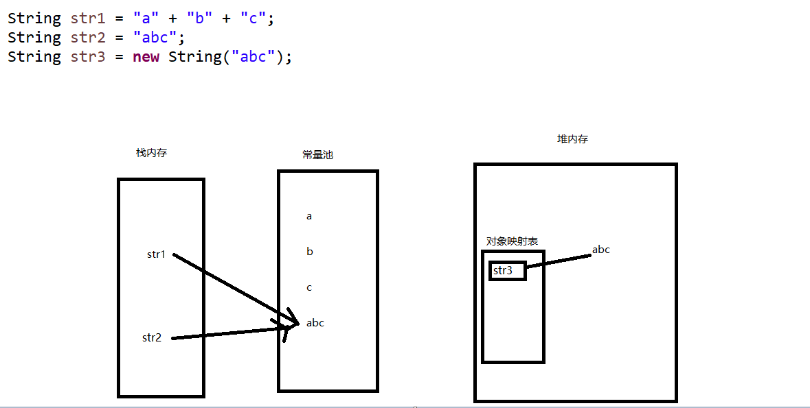

# String 的== 和equal的区别

JMV中，字符串都是存放在  常量池（或者静态区）中。



解读：

```java
		String str1 = "a" + "b" + "c"; // 这里并没有开辟堆内存，这个只是栈内存，指向常量池的abc字符串
		String str2 = "abc"; // 这里开了一个栈内存，指向 常量池中的abc字符串
		String str3 = new String("abc");// 开辟一个堆内存空间，
```

- 当执行第一行代码的时候，常量池中会创建出 a , b ,c ,abc这么4个字符串。然后栈上 分配出一个地址给str1，并且指向常量池中的abc。同时，堆内存中，会有一个对象映射表，把abc注册进去。

- 而运行第二行代码的时候，虚拟机会首先检查常量池中是不是存在abc，如果存在，栈上分配空间指向abc
- 运行第三行的时候，由于是new出来的对象，所以会在堆内存中分配一个空间给str3，并且指向堆中的abc

所以，如果是双等号比较：

```java
		System.out.println((str1 == str2));
		System.out.println((str2 == str3));
		System.out.println((str1 == str3));
```

那么结果是：

```java
true
false
false
```

第一个true是由于，str1，str2都指向了常量池中的同一个对象。

后面str2和str3比较，结果是false，是因为一个是指向常量池的abc地址，一个是指向堆内存中的abc地址。str1和str3同理。

但是：

```java
		System.out.println(str1.equals(str2));
		System.out.println(str2.equals(str3));
		System.out.println(str1.equals(str3));
```

但是如果是equals比较，那么3个str的内容完全一样。结果也就是：

```java
true
true
true
```

# 结论

String 的 == 比较的是内存地址，其实任何Object的==都一样

但是String的equals是重写过的，Object的equals就是==，而String第一步是对比==，如果是true，同一个对象了，那直接返回true相等。如果第一步==判定为false，那么就逐个对比字符序列，如果完全相同，才会返回true。

