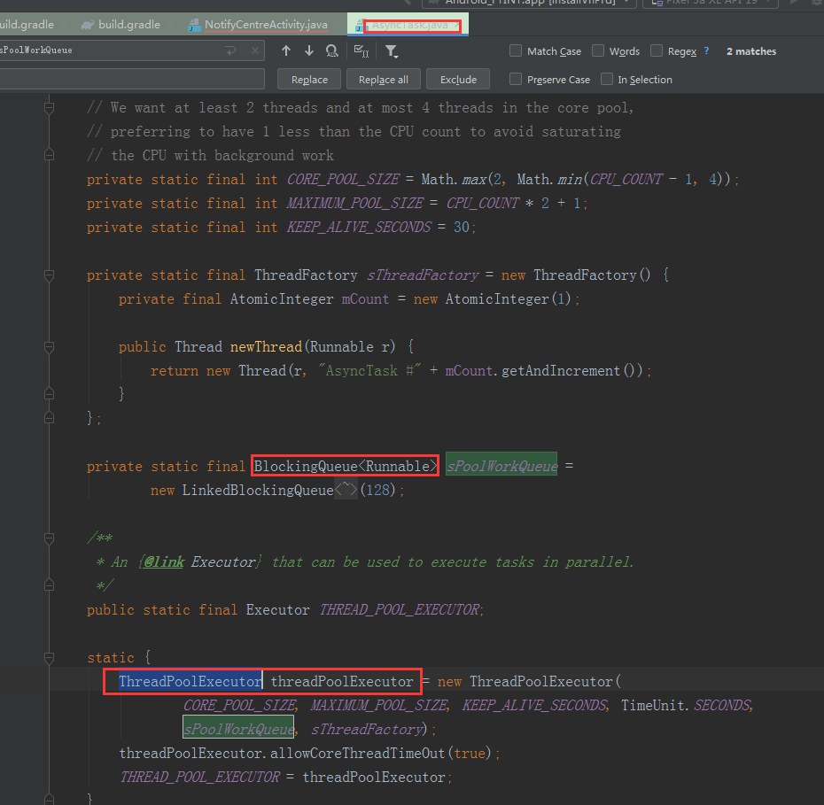

耗时操作，不能放在UI主线程就行了。

android中常用的非主线程耗时操作的方式有很多，比如 AsyncTask异步任务，Thread工作线程，Handler线程切换，Executor线程池。

所有切换到主线程的操作，都会用到Handler。

AsyncTask可以实现异步任务，最后通知主线程更新UI。现在逐渐很少去使用了，因为它有不可容忍的缺点：

1、cancel方法实现得有问题。如果doInBackground方法执行非常耗时，你cancel之后，这个doInBackground并不会立刻终止，而是会继续跑完，只不过之后的onPostExecute不会执行而已。所以，如果doInBackground非常耗时，耗内存，类似的任务开启过多的话，就很有可能内存泄漏，溢出。

从源码中可以看出，

它使用了线程池 ThreadPoolExecutor 来执行耗时任务。

2、内存泄漏。在Activity中使用匿名内部类来执行耗时操作，内部类会持有外部类的引用，而耗时操作，内部类对象的存活时间会跟随 doInBackground，如果doInBackground还在执行，而Activity即将回收，就会导致泄漏。

3、结果丢失，如果Activity发生屏幕旋转，或者被系统临时回收内存，再进入到该Activity时，都会导致Activity重建。而此时若onPostExecute方法执行，会指向一个无效的Activity引用，结果丢失。

 