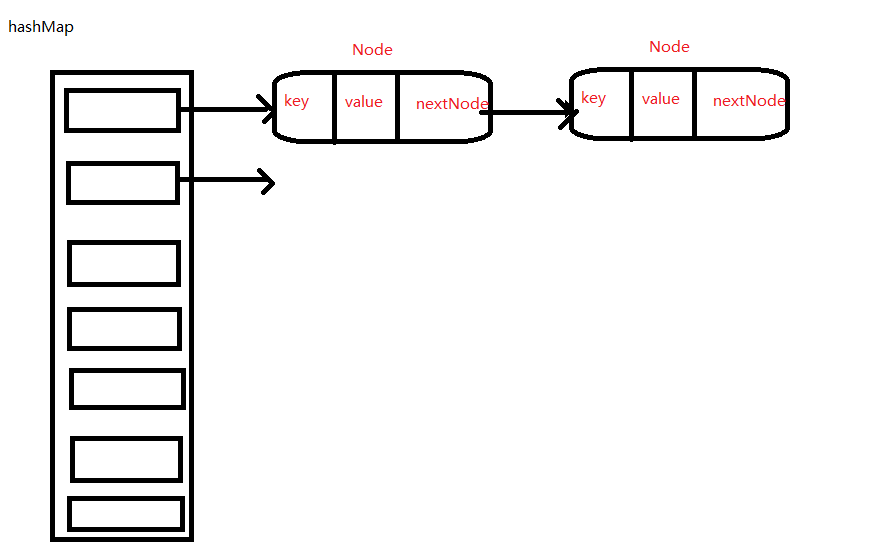
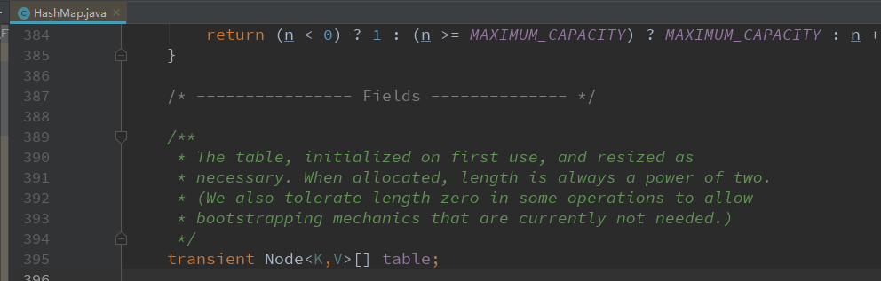
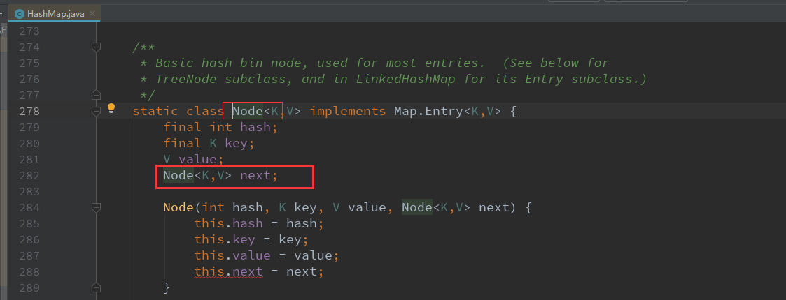
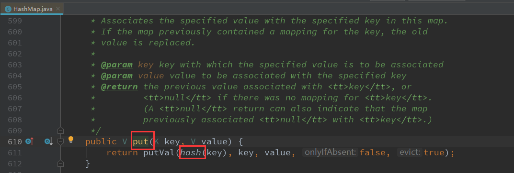
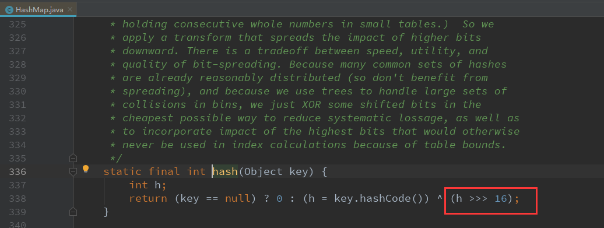
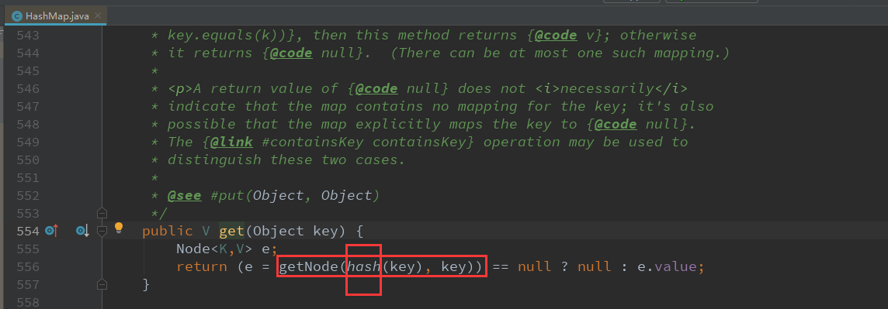
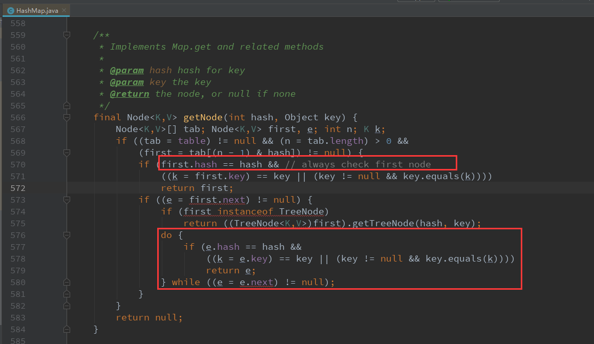
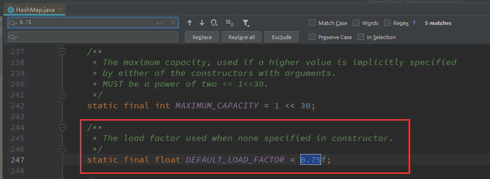
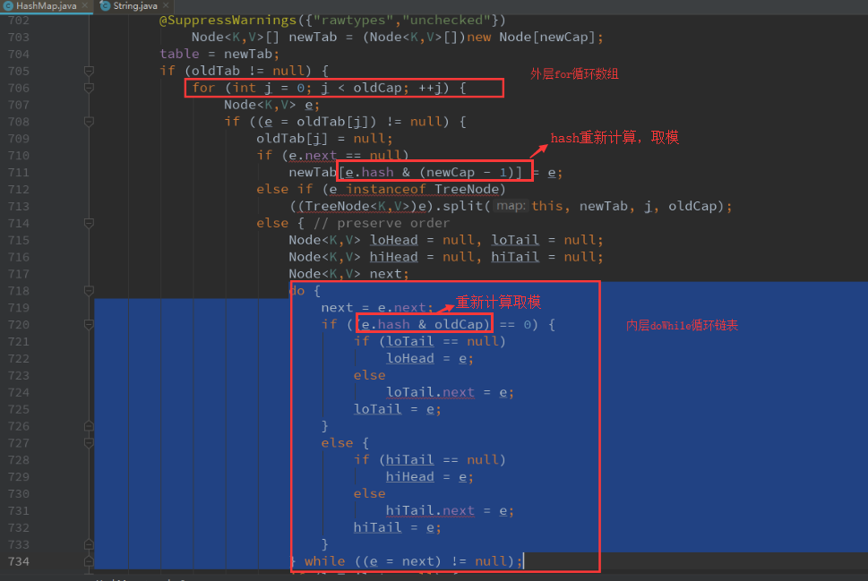

# 数组ArrayList和链表LinkedList

| ArrayList                                            | LinkedList                                                   |
| ---------------------------------------------------- | ------------------------------------------------------------ |
| 顺序表                                               | 链表                                                         |
| 物理上连续，查找速度快                               | 物理空间不连续，查找较慢                                     |
| 增删元素可能要扩容或者缩容，还要拷贝对象，增删效率低 | 增删元素只需要改变 **preNode**和**nextNode**的引用即可，无需拷贝，扩容缩容，增删效率高 |

# HashMap结构

hashMap，哈希表。结合了两者的优点。

> JDK1.8之前，hasmMap使用的是链表+数组。1.8之后时红黑树+数组。这里不讲。



这里只看 数组+链表。

这个结构有点像羊肉串。一个炉子上放一排铁棒，棒子上串一串羊肉。

table是炉子。





从源码中可以看出，table字段时顺序表，Node类又有一个next属性也是Node类型。它时一个单链表。

# hashmap中数组和链表是如何工作的

hashmap是如何快速进行增删改查......

从 get 和 put 方法 函数入手。

## put()方法



put函数中有一个hash。

什么是hash？任何对象都有自己的hashcode，任何类都存在一个hashCode()函数，这个函数可以重写。

**hash值**通常是通过**二进制位运算**得出的一个int值。涉及到高频率的计算，底层尽可能使用**位运算**，因为效率高。



这里经过一系列位运算，先确定一个数组的下标。这个也就是HashMap要插入一个元素时，把一个key值计算出一个数组下标。

至于这个确定下标的过程，其实就是**使用key的hash值对 table数组的size求模**的过程。

```java
假设 table数组的size是15
比如 key1对应的hash1 是1 
那么 1%15 = 1. 这个key1/value1就会被放在table下标为1的链表内。
 
如果 key2对应的hash2 是16
16%15=1，也是1. 那么这个就叫hash碰撞，或者hash冲突。

所以，这种情况下，key1/value1 和key2/value2 就都被放在同一个数组下标为1的链表中，后放入的key2/value2在链表后方
```


那么这一次**put**，就会插在这一排**羊肉串**上。

### hash冲突

那么如果多次put，按照上面的key的计算方法，计算出的数组下标相同，怎么办？这种情况就是 hash冲突。

**羊肉串的铁棒有了，羊肉从哪来**，羊肉就是 **Node**节点，如果**hash**冲突，就放在同一排，然后把后来的**Node**作为前一个**Node**的**next**属性 .

这样就形成了一个链表。

## get方法



存入的时候，要先计算key的哈希值，然后 找到目标所在的数组下标，然后沿着链表去查找，直到找到 目标Node，取得value值。

### 链表是如何轮询的？

优先查找第一个Node，如果第一个的key不相同，那么再接着do while循环查找后面的，直到找到位置。到了最后还找不到，就返回null。



# 其他知识点

影响hashmap性能的····

## 加载因子



这个参数的作用是，当插入时，hashmap的table数组的下标已经使用了超过75%，那么数组就会自动扩容，再插入。

hashMap的初始容量是0， 当put一个元素的时候，数组size+1，链表size+1. hashMap只有一根羊肉串的**铁棒**。

当再put一个元素的时候，假如说此时hash碰撞了，这个元素也被放在了第一个数组元素对应的链表里。这是最坏的情况。而好的情况就是，hash不冲突，**数组扩容**。这个元素放在另外的**铁棒**上。

# 常见问题

- hashmap的扩容会不会导致什么问题?

  容量的调整是发生在 容量比达到了加载因子（默认0.75，可以外界指定）.  扩容的函数是resize(). 这个时候，提到之前的hash碰撞。可能出现下面的情况：

  ```java
  还是假如table数组的size是15.
  如果put的时候，key1/value1 键值对，key1的hash值是16，那么 
  16%15 = 1 ，key1/value1会被放在下标为1的位置插入链表。
      
  如果后续，由于插入元素增多，数组扩容了一倍。现在的容量是 30.
  我key1的hash值还是16，我按照get的函数，去找数组下标的时候，发现，
  16%30=16， 程序就会去 table下标是16的链表中去找。然后发现，找不到。
  
  但是我明明就是put进来的时候，确实把键值对put进来了。
  只不过我put的位置是数组下标是1，扩容之后，查找的位置是 下标16。
  
  当然就找不到了。。。
  ```

  但是还好，在resize函数中，对所有 Node羊肉的hash进行了重新计算，而且重新编排。

  下图是源码，每个版本可能不同，但是思路相差不大。外层for循环对table数组进行遍历，内层对每一条链表进行遍历，找到每一个节点，找到他们的key进行重新hash计算。这样就可以确保get的时候依然能找到。

  

  

- 为什么String，Integer这样的封装类型适合作为key？

  答：因为封装类型已经重写了hashCode函数。

- Java8之后，对HashMap有什么改进？

  java8使用红黑树（二叉平衡树）替代了链表，进行了效率改进。链表，查询一个元素的时间复杂度是O(n)，换成 红黑树之后，查找一个元素的效率是 O(logN), 效率更高。

- SparseArray 和 HashMap有什么区别?

  hashMap的key是Object封装类型。SparseArray把key换成了int类型.put和get都是基于二分查找。提高了效率。

  


