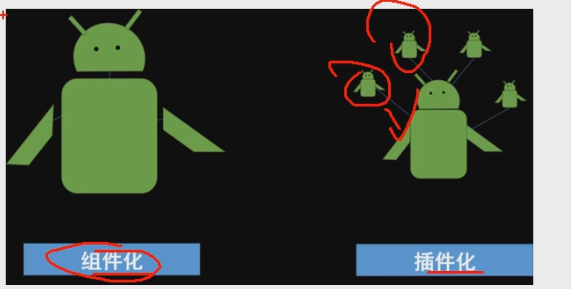

| 序号 | 插件化 | 热修复 | 组件化 |
| ---- | ------ | ------ | ------ |
| 1    |        |        |        |
| 2    |        |        |        |

# 插件化

源于，免安装apk。不用安装apk就能运行app的功能。一般存在 **宿主app**和**插件app**的概念。

同样的功能，使用插件化，可以减小原apk的大小，另外，插件apk可以动态更新，修复。

插件化，就是把 不常用功能，做成可以灵活拔插的插件apk。

会使用到java的动态编程技术，也就是反射。

# 热修复

在有热修复之前，修复bug必须重新对app发版。

热修复的定位，是快速修复掉项目中细小的bug，包括代码bug，资源bug，so库bug。

热修复有自己的局限性，不能完全替代发版。

1、 补丁只能针对某一个版本，随着版本差异变大，补丁包也会无限增大。因为作为补丁包，后一个补丁包必须 包含前一个补丁包的所有内容。

2、补丁不支持所有的修改，比如清单文件 manifest ，这是android内核决定的

3、热修复的成功率并不能保证100%，这是由于手机厂商会针对rom层进行定制，所以我们做的一些热修复核心代码的反射操作可能失效。

# 组件化

和插件化一样，他也是类似的功能拔插。

但是，组件化是在 开发阶段的拔插。插件化是在发布app之后，依然可以拔插。

组件化可能会用到gradle编程。

组件化是机器人合体。

插件化是，功能”外挂“。在主app之外可以随意使用外挂功能。

