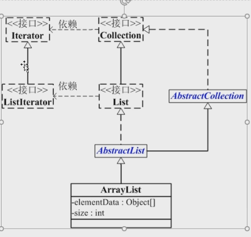

# ArrayList的特性

ArrayList的本质是数组，而数组的容量是固定的，所以增删元素的时候，都可能伴随着数组的复制 System.arrayCopy(...)

ArrayList 的继承关系：

Iterator, 迭代器，作用是快速遍历容器。

迭代器只有3个接口，hasNext()，next()，remove().

for循环虽然也能遍历容器，但是并不是JDK推荐的方法。

====================================================

常见面试问题：

- ArrayList的大小是如何自动增加的？

  ArrayList本质上是基于数组实现的，数组的容量是固定的，所以ArrayList要增加容量大小，就只能进行数组复制，把原先数组中的内容，拷贝到容量更大的数组中, 然后把大数组赋值给数组成员属性。如果数组太小，add一个元素都放不下，那么，首先会先进行扩容，然后再放入新元素。ArrayList中数组成员变量的初始容量是 10（可能会随着JDK的不同而变化）.
  
- ArrayList 一般在什么时候使用？

  这就必须提到ArrayList的优缺点，

  优点：在尾部插入元素非常快速。因为就是一个单纯的数组元素赋值。
  
  但是，缺点，在 中间插入元素就比较尴尬了，必须先copy数组，然后设置目标元素的值，然后把后半段数组也连接起来。
  
  所以，当我们有需求涉及到排序操作的时候，不要用arrayList，因为每一次位移元素， 都有可能伴随数组的拷贝，非常耗时。这个时候应该用**LinkedList**, 链表结构，在元素位移的时候效率很高。
  
  但是如果只是作为一个存储容器，用于查询，那ArrayList就很合适。
  
-  ArrayList可以顺序删除节点么？
   
   可以。ArrayList可以支持迭代器删除元素的方式。但是别用for循环，因为你从头往后删除元素可能会导致数组的拷贝
   
- ArrayList 怎么遍历

  For循环遍历，Iterator遍历都可行，但是 for循环拿到元素之后别做增删操作。

- 顺序表的优点

  ArrayList作为一个顺序表，它支持高效的随机访问，支持高效的尾部插入删除。但是，从中间进行增删，效率很低，因为存在数组复制。

