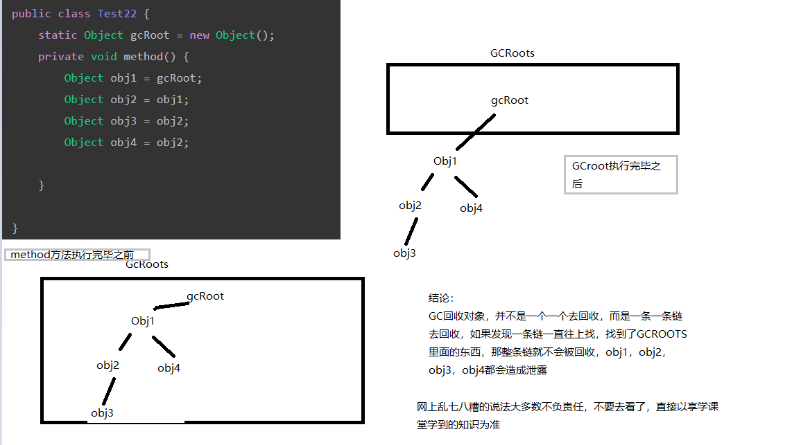

# Java回收机制

判断对象的存活情况。采用的是GcRoots可达性分析算法。

能够作为GcRoots的是：

- 方法区的类静态属性

  ```java
  public class Test22 {
      private static String str = "str";  // 某个类的静态成员变量
  }
  ```

  

- 方法区的常量

  ```java
  public class Test22 {
      private static final int tag = 697;
  }
  ```

  

- 虚拟机栈（本地变量表）中的对象

  ```java
  public class Test22 {
  
      private void method() {
          Object obj1 = new Object();
          Object obj2 = obj1;
          Object obj3 = obj2;
          Object obj4 = obj2;
          
      }
  
  }
  ```

  所谓虚拟机栈，本地变量表，也就说，当method方法在执行过程中，它所涉及到的变量都是GCRoots,不可回收。方法执行完毕之后，就不再是GcRoots。

  但是，如果这样：

  ```java
  public class Test22 {
      static Object gcRoot = new Object();
      private void method() {
          Object obj1 = gcRoot;
          Object obj2 = obj1;
          Object obj3 = obj2;
          Object obj4 = obj2;
  
      }
  
  }
  ```

  方法内部的变量，持有了静态成员gcRoot的引用。那么，即使方法执行完毕，引用链依然存在，这就会导致obj1，obj2，obj3，obj4，都无法回收，造成泄漏。

  

  

  

- 本地方法栈JNI中的对象

  和本地变量表一样理解即可。

# 如何减少OOM

1. 尽量减少内存泄漏

   泄露多了，可用的就少了，泄漏越多，可用越少，迟早会OOM。

2. 尽可能不要循环中去申请内存

   方法执行过程中，方法中的变量都是GCroots，方法执行完毕之前，都不会得到回收，如果循环申请内存，可用内存会越来越少。

3. 尽可能不要在调用次数多的函数中去申请内存

   比如，自定义控件的onDraw方法中，你写了动画效果，高频率刷新，onDraw方法就会频繁调用，加大GC的压力。

