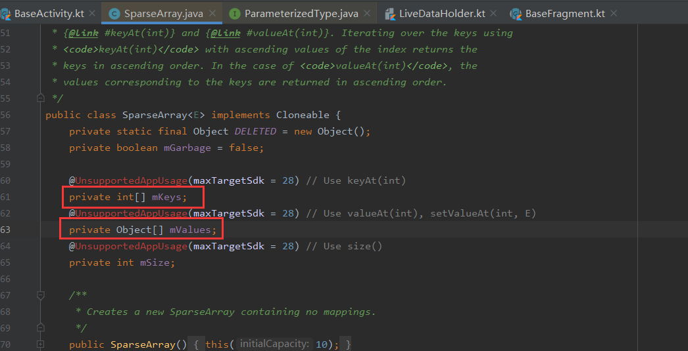
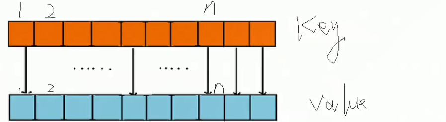
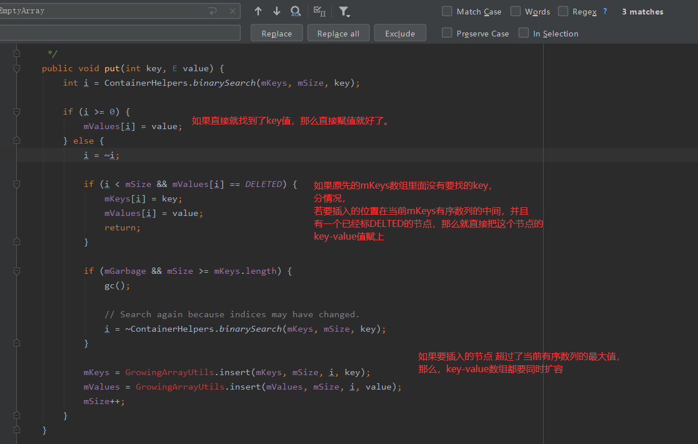
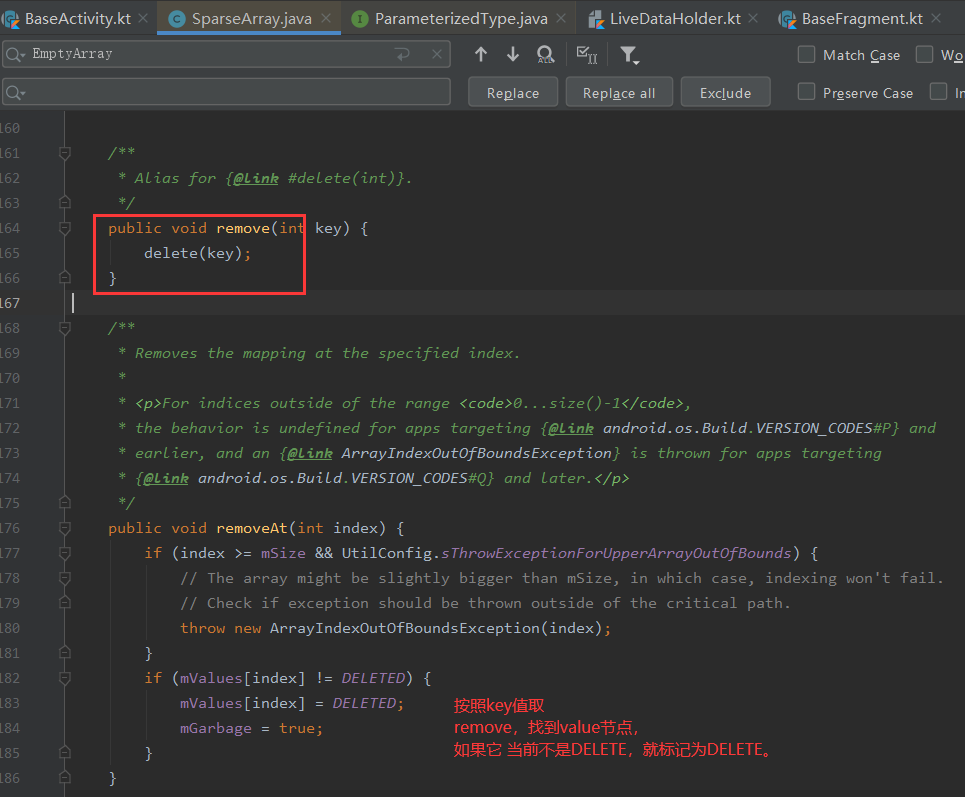
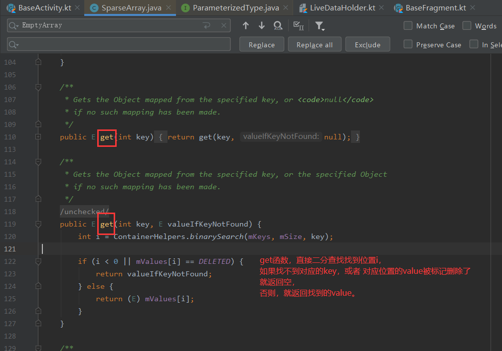

# HashMap与SparseArray的性能对比

SparseArray是来自HashMap的改造。

将hashmap的key从 Object类型，换成了int类型。一个int占据4个字节，一个Object是封装对象，占内存肯定超过int.

hashmap的装载因子，默认是0.75，装载因子可以减少哈希冲突，提前扩容。因为链表越短，查找效率越高。虽然查找效率提高了，但是势必有0.25的空间浪费。这是hashmap提高效率的代价。

# HashMap的性能弊端

- 当插入元素时，检测到插入之后数组有效元素个数超过阈值（数组当前容量x加载因子默认0.75）之后，就会进行数组扩容，扩容的目的是减少哈希冲突，但是这个也导致了 必然的空间浪费。
- 

而sparseArray：

它的结构是两个数组。**mKeys**数组，**mValues**数组。

key是int类型，value与key一一对应.

sparseArray 依然是数组+链表的结构，只是 key的类型换成了int，而且没有空间浪费。

- put方法

  sparseArray的put方法，在put的时候，需要传入一个key（int）和value（Object），put之前，会先使用二分查找的方式，先找到插入的节点，key的序列mkeys[] 是一个有序数组.

  

- remove

  

  remove操作，只是一个软删除，标记删除。

  那么这样会不会造成空间浪费呢？显然不会，去看put函数，这个DELETE标记下的节点，可能会被重复利用。所以不会浪费。

- get

  

  

  SparseArray的优点：

  与hashmap相比，用得越多，空间越省。SparseArray的put，get，delete的效率都极高。

  

  但是，SparseArray只有在key是int类型时候可用。而如果是其他类型，甚至是泛型，就算数组扩容效率低，空间浪费，也要用hashMap.

  

  