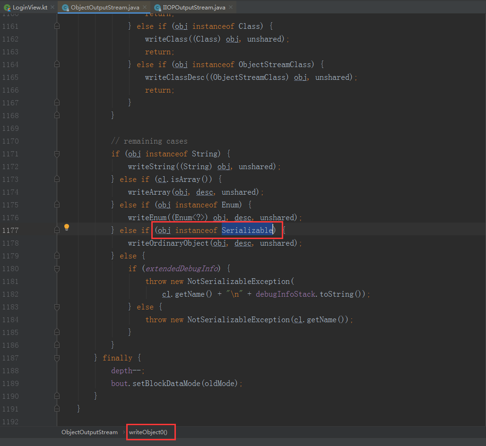

# 序列化的概念

把一个对象转化成可在网络中传输的形式。安卓开发中常见的序列化方式有两种 Serializable , Parcelable

安卓中谷歌推荐使用Parcelable。

Serializable 是JDK中提供的一个接口，但是没有约束任何方法，它是一个空接口。

它只能用来做标记，在其他类中用来区分这个对象是否可序列化反序列化。

Java 中，常用到Serializable  的源码类，主要是 针对对象的流操作。比如：**ObjectOutStream,ObjectInputStream,ObjectInput,ObjectOutput.**

如下图，ObjectOutputStream 源码中对写入对象的 obj ，会判断该对象是否实现了 Serializable.

Serializable序列化一个对象的时候，会把该对象的类名，属性类型，属性名，全都转化成二进制，最终形成一个二进制文件保存起来，在网络上传输。而，收到这个二进制文件，然后进行反序列化的时候，是根据相反的流程，将对象的类名，属性类型，属性名等，通过反射的方式还原出来，最终再形成一个对象。由于反射的存在，效率不会太高。

而 Parcelable. 它虽然也叫序列化，但是它负责的范围，并不是在网络范围内传输，而是 只能在android内存中。

序列化的时候，它只记录属性的值, 而不是像Serializable一样，记录属性名和属性值。它只有把属性值转化成二进制. 把所有的属性值按照一定的顺序，转化成完整的二进制序列。 而，接收者，必须按照同样的顺序去解析。才能还原成相同的对象。

===========================

网络上传输，除了Jdk的Serializable，android的Parcelable之外，还有JSON规则，XML规则，protobuf等，

JSON和XML都是人眼能够看懂的数据格式,方便调试，但保密性更低，Protobuf也是二进制，比较特殊，效率较高。

======================

无论是什么样的序列化方式，都有自己的规则。

